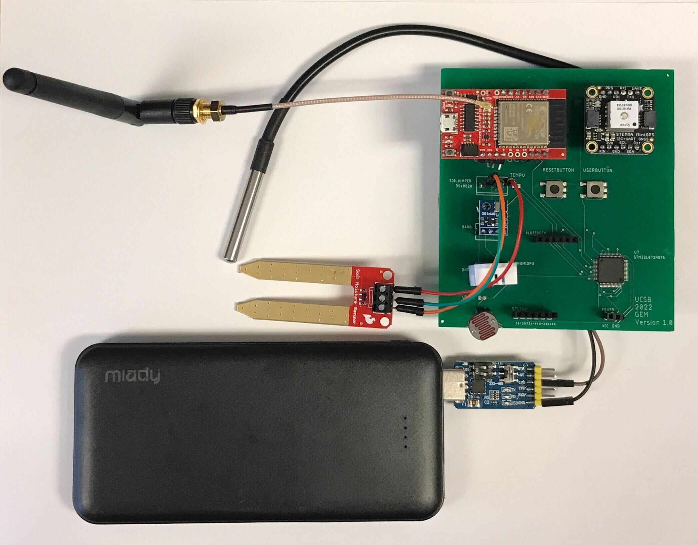

#Geographical Environment Module (GEM)

   
####(Left)Version 1 (Middle & Right)Version 2

# Content
1 - About this project
2 - System Block Diagram
3 - Required Software
4 - Key Hardware Components
5 - File Structure
6 - Operation & Results
7 - Reference Sites
8 - Todos / Improvements

# 1 - About this project
Geographical Environment Module (GEM) is a LoRaWAN-enabled environment sensing system intended for agricultural and environment protection monitoring. This repository shows a demo system, it consists of one gateway and upto twelve nodes. The goal is to capture several environmental parameters, and send them through the LoRaWAN network to a data-logging system/computer. The data can then be further analyzed by other applications.

This repository is a technical archive for a computer engineering capstone project at Univeristy of California, Santa Barbara. For general information regarding the project, please visit https://web.ece.ucsb.edu/~yoga/capstone/projects/2022/

Student Contributors:
Alejandro Diera
Larry Mai
Michael Sanchez
Sawyer Essabhoy
Yuen Ming Pang

*Special thanks to Laritech, Inc., Prof. Isukapalli, Chris Cheney, and Brycen Westgarth for thei help and guidance.

# 2 - System Block Diagram

- "ESP32 Transmitter" only relays messages to attached RFM95W transceiver. This can be removed in future iterations.
- Program should be compatible with most STM32 series chips with the mentioned peripehrals with minor modifications.

# 3 - Required Software
| Name | Function |
| ------ | ------ |
| STM32CubeIDE | STM32 chip programmer and debugger |
| Arduino IDE | ESP32 module programmer |
| MATLAB2022a | Real-time data monitoring |

# 4 - Key Hardware Components
| Gateway | Function |
| ------ | ------ |
| SparkFun WRL-18074 (embedded RFM95W) | LoRaWAN gateway |

| Node | Function |
| ------ | ------ |
| STM32L072RBT6 | central processor |
| SparkFun WRL-18074 (embedded RFM95W) | LoRaWAN node |
| Adafruit PA1010D | GPS |
| Adafruit BMP180 | Barometric sensor |
| Adafruit DHT22 | Air temperature & moisture |
| Adafruit Waterproof 1-Wire DS18B20 Compatible Digital temperature sensor | Soil temperature |
| LDR | Light intensity |
| SparkFun SEN-13322 | Soil moisture |
| 5V + 3.3V supply | Power supply |

# 5 - File Structure
 | Important File | Content |
 | ------ | ------ |
 | Code_Chip | Main processor program |
 | Code_Gateway | Code for gateway w/ library |
 | Code_Node | Code for node w/ library |
 | Code_MATLAB | Real-time MATLAB plotting script |
 | PCB_V2 | Schematic and PCB |

# 6 - Operation & Results

- Node boot time until first message received by gateway should be within 5s.
- Demo reached a maximum range from gateway of around 40m. Improvement needed.
- Fluctuations and drifting were observed.

- On MATLAB, readings from multiple nodes can be displayed in real time. Each row here represents one node.

# 7 - Reference Sites
| Name | Link |
| ------ | ------ |
| STM32L072RBT6 | [STMicroelectronics][Chip] |
| SparkFun WRL-18074 | [SparkFun][LoRaWAN] |
| Adafruit PA1010D | [Adafruit][GPS] |
| Adafruit BMP180 | [Adafruit][BMP180] |
| Adafruit DHT22 | [Adafruit][DHT22] |
| Adafruit Waterproof 1-Wire DS18B20 Compatible Digital temperature sensor | [Adafruit][DS18B20] |
| SparkFun SEN-13322 | [SparkFun][Soil] |

# 8 - Todos / Improvements
- Reduce power consumption
- Replace sensors with high quality alternatives
- Remove redundant sensors
- Remove GPS and use LoRaWAN localization
- Find a LoRaWAN solution without the SparkFun gateway (e.g. direct integration with a RFM95W chip)
- Add mounting points on PCB and design a protective case

   [Chip]: <https://www.st.com/en/microcontrollers-microprocessors/stm32l072rb.html>
   [LoRaWAN]: <https://www.sparkfun.com/products/18074>
   [GPS]: <https://www.adafruit.com/product/4415>
   [BMP180]: <https://www.adafruit.com/product/1603>
   [DHT22]: <https://www.adafruit.com/product/385>
   [DS18B20]: <https://www.adafruit.com/product/381>
   [Soil]: <https://www.sparkfun.com/products/13322>